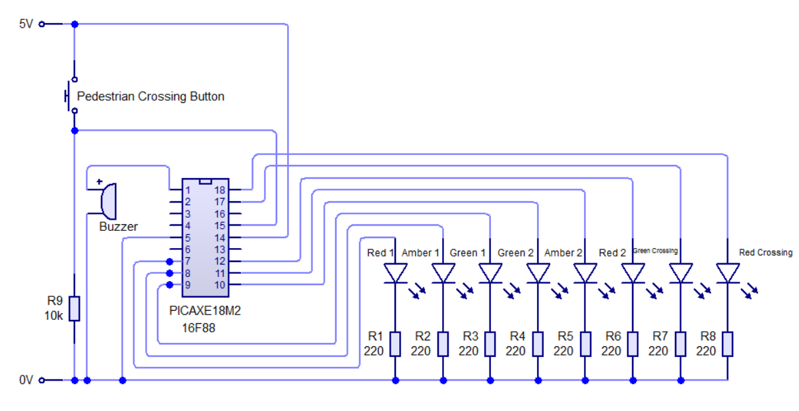
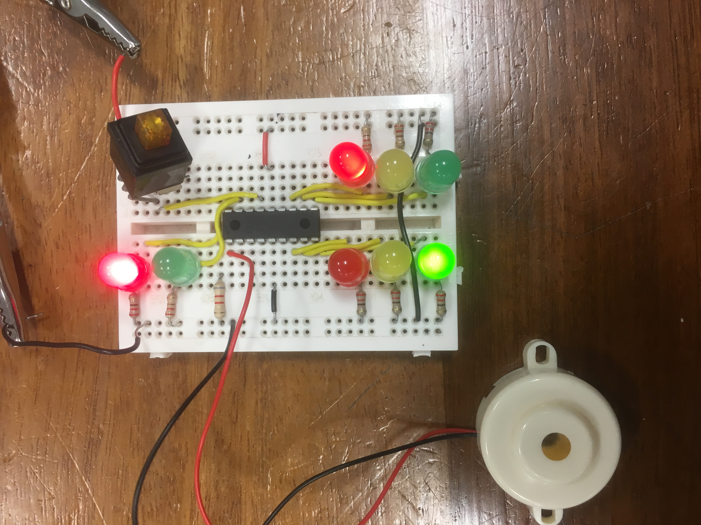
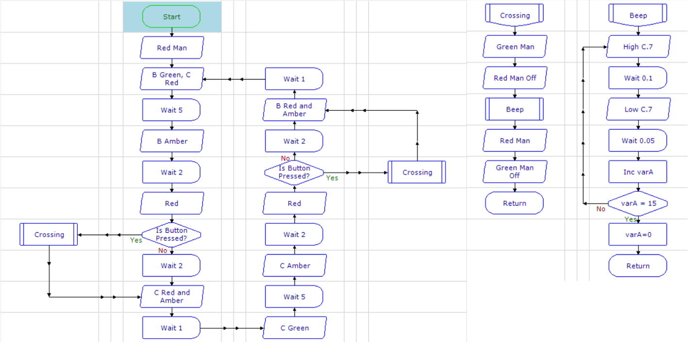

# Traffic Light Control System

## Table of Contents

- [Introduction](#introduction)
- [Brief](#brief)
- [Circuitry](#circuitry)
- [Flow Chart](#flow-chart)
- [Further Work](#further-work)

## Introduction

I made this project for my A-level Electronics course in 2018. Using a PICAXE 18M2 and the WJEC assembler programming language I prototyped a set of two traffic lights with a pedestrian crossing. [Here is a link to the WJEC Assembler instruction set](./WJEC_Instruction_Set.pdf)

## Brief

My brief was to create two sets of traffic lights which take turns in allowing the traffic to flow. When a pedestrian presses the button to cross, both sets of lights bring the traffic to a halt. The green pedestrian light then shows and the buzzer sounds. Once they have crossed, the red pedestrian light is shown and the buzzer stops before the regular traffic light sequence resumes.

## Circuitry

 

 

## Flow Chart

 

## Further Work

In the future I could;

- Change to using a momentary "crossing" button
- Design miniature traffic light enclosures to be used with a model railway

